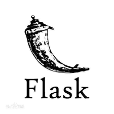

### Hi there 👋

My name is Haythem, I'm Data Scientist, Kaggle competitions expert and Top rated Upwork freelancer who loves solving business related problems with the help of data and analytics.

💡 Skills: MLOps, Problem solving, Natural language processing, Data Analysis, Computer vision. 

  &nbsp;&nbsp;&nbsp;&nbsp;
  &nbsp;&nbsp;&nbsp;&nbsp;
  &nbsp;&nbsp;&nbsp;&nbsp;

## ⚡ Latest article

<!-- BLOG-POST-LIST:START -->
 - 🔥 [Optimization of the life cycle of an ML project using MLflow and DVC](https://medium.com/@haythemtellili/optimization-of-the-life-cycle-of-an-ml-project-using-mlflow-and-dvc-646553985ca0)
<!-- BLOG-POST-LIST:END -->

## ⚡  Honors

<!-- BLOG-POST-LIST:START -->
 - 🥇 [Silver medal in Jigsaw Multilingual Toxic Comment Classification (Top 5%)](https://www.kaggle.com/c/jigsaw-multilingual-toxic-comment-classification)
 - 🥇 [Silver medal in the Tweet Sentiment Extraction (Top 3%)](https://www.kaggle.com/c/tweet-sentiment-extraction)
 - 🥇 [Bronze medal in SIIM-ISIC Melanoma Classification (Top 6%)](https://www.kaggle.com/c/siim-isic-melanoma-classification)
 - 🥇 [1st Place in the Basic Needs Basic Rights Kenya - Tech4MentalHealth Challenge](https://zindi.africa/competitions/basic-needs-basic-rights-kenya-tech4mentalhealth/leaderboard)
 - 🥇 [2nd Place in the UMOJAHACK Africa 2020](https://zindi.africa/competitions/umojahack-1-saeon-identifying-marine-invertebrates)
<!-- BLOG-POST-LIST:END -->

## ⚡  Technologies I use 

 

    <table align="center">
        <tr>
            <td align="center" width="140" height="112.43">
                
                  Python
            </td>
            <td align="center" width="140" height="112.43">
                
                  Jupyter
            </td>
            <td align="center" width="140" height="112.43">
                
                  PyTorch
            </td>
            <td align="center" width="140" height="112.43">
                
                  Scikit Learn
            </td>
            <td align="center" width="140" height="112.43">
                
                  MLflow
            </td>
            <td align="center" width="140" height="112.43">
              
                Flask
            </td>
            <td align="center" width="140" height="112.43">
                
                  Docker
            </td>
        </tr>
    </table>

 
